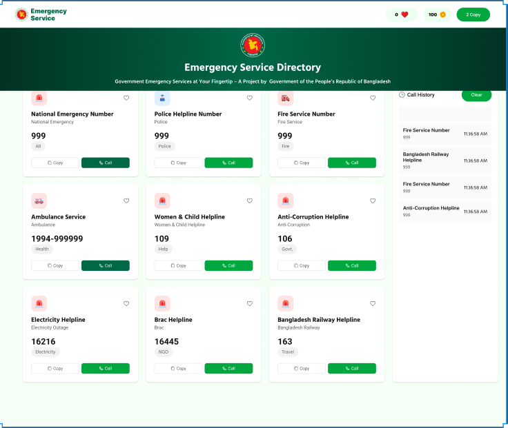

# 🚑 Emergency Hotline Website — Assignment 005

## 📌 Project Overview

The Emergency Hotline Website is a responsive web application developed using **HTML, Tailwind CSS, and Vanilla JavaScript**. This project allows users to quickly access important emergency hotline services and interact with them dynamically.

Users can increase heart counts, copy hotline numbers, simulate calling services, and view call history. Each call deducts coins from the user balance and stores service information along with call time in the history section.

The main objective of this project is to practice **DOM manipulation, event handling, dynamic UI updates, and responsive design** without using any JavaScript framework or library.

---

---

## 🌐 Live Project

🔗 Live Link: https://parety308.github.io/Emergency-Hotline./index.html  
📂 GitHub Repository: https://github.com/ProgrammingHero1/B12-A5-Emergency-Hotline

---

## ⚙️ Technology Stack

- HTML5
- CSS3
- Tailwind CSS
- Vanilla JavaScript

---

## ✨ Features

### ✅ Navbar
- Website logo and name
- Heart counter
- Coin count (Default: 100)
- Copy count display

### ✅ Hero Section
- Gradient background
- Centered logo
- Title and slogan

### ✅ Emergency Hotline Cards
Each card includes:
- Service image/icon
- Service name
- English name
- Hotline number
- Category badge
- Heart icon
- Copy button
- Call button

Minimum 6 emergency cards are displayed.

### ✅ Heart Functionality
- Clicking heart icon increases heart count in Navbar.

### ✅ Call Functionality
- Shows alert with service name and number
- Deducts 20 coins per call
- Prevents call if coins are less than 20
- Adds service to Call History
- Shows call time dynamically

### ✅ Copy Functionality
- Copies hotline number to clipboard
- Shows alert message
- Increases copy count

### ✅ Call History Section
- Initially empty
- Dynamically filled after calls
- Displays service name, number, and call time
- Clear History button removes all records

### ✅ Responsive Design
- Fully responsive for mobile devices.

---

## 📘 Assignment Questions & Answers

### 1️⃣ Difference between getElementById, getElementsByClassName, and querySelector / querySelectorAll

**getElementById()**
- Selects an element using its unique ID.
- Returns a single element.

Example:
```js
document.getElementById("title");

**getElementById**                                 
                                                
Selects a single element with the given id.         

Returns a DOM element (or null if not found).

Only one element should have a particular id on the page

**getElementsByClassName**

Selects all elements with the given class name.

Returns a live HTMLCollection (updates automatically if elements are added/removed).

You usually need a loop to work with multiple elements.
**querySelector**
Uses CSS selectors to select elements.

Returns only the first element that matches the CSS selector.

Returns a single DOM element (or null if nothing matches).

**querySelectorAll**

Returns all elements that match the CSS selector.

Returns a NodeList (can be empty if nothing matches).

You can loop through it with forEach, for..of, or convert it to an array.

---
## 👨‍💻 Author


**MD Parvez Hasan**  
MERN Stack Developer

- 📧 Email: parvezyesrat17032024@gmail.com 
- 📱 Phone: +8801876097788 
- 💼 LinkedIn: www.linkedin.com/in/md-parvez-hasan-967729344  
- 🐙 GitHub:https://github.com/parety308